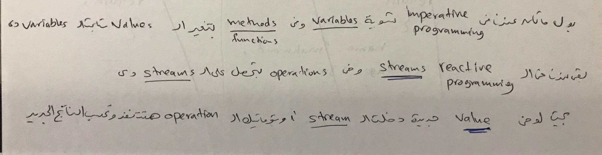

# Reactive Programming

## Index

* [Resources](#resources)
* [Intro](#introduction)
* [Observer Pattern](#observer-design-pattern)
* [Operators](#operators)

## Resources

* [The introduction to Reactive Programming you've been missing](https://gist.github.com/staltz/868e7e9bc2a7b8c1f754)
* [ReactiveX](http://reactivex.io/)
* [RxJs: Library for JavaScript which is implementation of ReactiveX](https://github.com/ReactiveX/rxjs)

## Introduction

Reactive programming is a programming paradigm oriented around data flows and the propagation of change. The hardest part of the learning journey is thinking in Reactive. It's a lot about letting go of old imperative and stateful habits of typical programming, and forcing your brain to work in a different paradigm.

* Terms like streams, observables, RxJs, operators, marble diagrams
* Reactive programming is programming with _asynchronous_ data streams.
* Reactive programming = streams + operations.
* Streams are just a sequence of values over a time.
* anything can be a stream: variables, user inputs, properties, caches, data structures,
* The "listening" to the stream is called _subscribing_
* In common Reactive libraries, each stream has many functions attached to it, such as map, filter, scan, etc. When you call one of these functions, such as clickStream.map(f), it returns a **new stream** based on the click stream. It does not modify the original click stream in any way. This is a property called immutability
* Observable is a blueprint
* [RxJs](https://github.com/ReactiveX/rxjs) (Reactive Programming library For Javascript)
* RxJs is an implementation of the ReactiveX API
* Example:

    ```javascript
        let obs = Rx.observable.interval(1000)
                                .take(3)
                                .map((v)=> Date.now);
        obs.subscribe(value => console.log('subscription date is:' + value));

        // subscribe(success callback, error callback[optional], complete callback[optional])
    ```

* 
* You don't have to know reactive programming or RxJs to use them in Angular, but it is a good thing if you want to archtict an application
  * Angular installs RxJS for us, which is an asynchronous programming library that favors Observables over promises. so you don't have to use promises (You can still use promises if you really want)
* Example in Angular

    ```javascript
        // form is an observable
        form.valueChanges.filter(data => {
            return data;
        }).map(data => {
            return data;
        }).subscribe(data => console.log(data));
    ```

## Observer Design Pattern

## Operators

* **buffer**  
    Periodically gather items emitted by an Observable into bundles and emit these bundles rather than emitting the items one at a time. Check [this](./rxjs-click-example.html)
* **map** eg: map(f), takes each value of stream A, applies f() on it, and produces a value on stream B