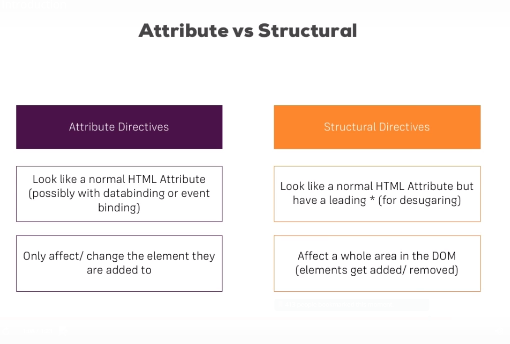
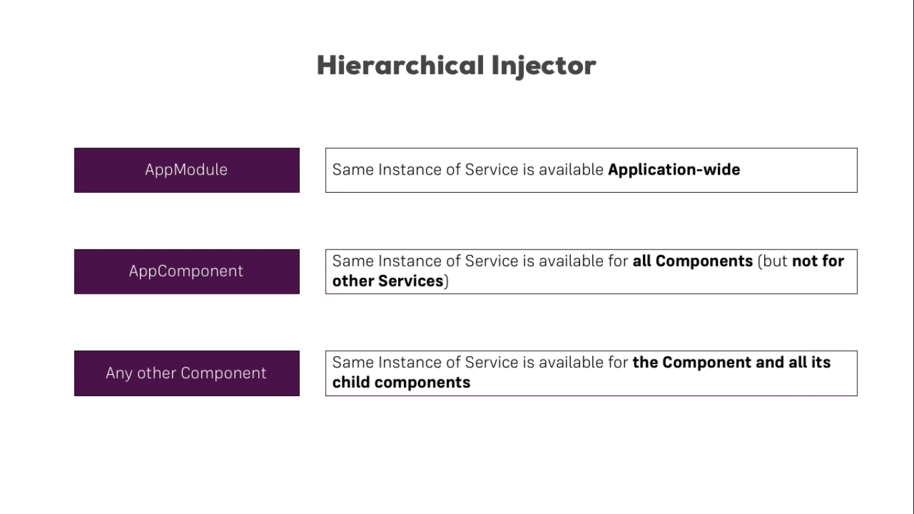
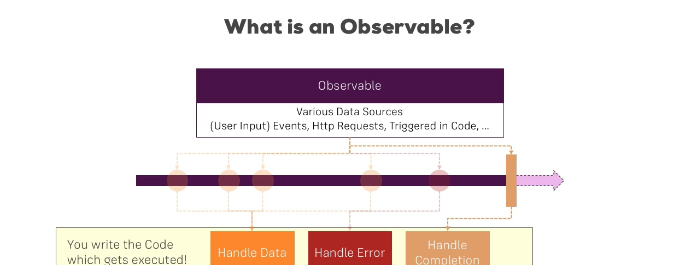

# Angular Outline

## Index

* [Modules](#modules)
* [How angular app gets loaded and started](#How-angular-app-gets-loaded-and-started)
* [Components](#Components)
* [Template Syntax](#template-syntax)
* [Data Binding](#data-binding)
* [Services and Dependency Injection](#Services-and-Dependency-Injection)
* [Routing](#routing)
* [Observables](#Observables)
* [Forms](#forms)
* [Pipes](#pipes)
* [Misc](#misc)
* [Typescript](#typescript)
* [Debugging](#Debugging)
* [Commands](#commands)
* [Useful Libraries](#useful-libraries)
* [Resources](#resources)

## Modules

* Angular is modular.
* Any angular application has at least one root app module which is `AppModule` in `app.module.ts`
* The root module can have any number of sub modules.
* Each module has its own compliation context.
* The module can contain any number of `components`, `directives`, `pipes`...

  ```typescript
    import { BrowserModule } from '@angular/platform-browser'; // These are ES6 javascript modules
    import { NgModule } from '@angular/core';

    import { AppComponent } from './app.component';

    // @NgModule is a function taking single metadata object
    @NgModule({
        // any thing related to this module, component, directive, pipes...
        declarations: [
            AppComponent
        ],
        imports: [ // import modules
            BrowserModule
        ],
        providers: [], // services, if it's in AppModule, it will be accessible through the entire app like Logger service. But you can create services in the component level and it's preferable.
        bootstrap: [AppComponent], // This property only in the root module, this is telling angular what the entry/root component of the app
        export: []; // Items (eg: component) to be exported
    })
    export class AppModule { }
  ```

***

## How angular app gets loaded and started

* `main.ts` (starter of our application) > `AppModule` > `bootstrap: [AppComponent]`
  * `platformBrowserDynamic().bootstrapModule(AppModule)` in `main.ts`
  * `bootstrap: [AppComponent]` in `AppModule` Angular will not scan your files by default, you should tell him which component to load

***

## Components

* [Reference Project](./projects/section-5-components-and-databinding/src/)
* Each component has Typescript file (eg: app.component.ts) and HTML template file (eg: app.component.html)
* Every component must be declared in exactly one `ngModule`
* All properties of component only accessable inside this component, if you want parent-child communication use `@Input` and `@Output` decorators.
* Component communication is so important, check project _section-5-components-and-databinding_
* `@Input('srvElement') element: {type: string, name: string, content: string};` pass data from parent to child.
* `@Output('bpCreated') blueprintCreated = new EventEmitter<{serverName: string, serverContent: string}>();` emmits data from child to parent.
* There is a better way for communication which is services.
* View encapsulation in Angular, each component has its own CSS, even it will not affect child components. You can override this behaviour.
  * Default is `Emulated`
  * `None` it will not use view encapsulation for this component, it will remove all '_ngContent-iui-0...' attributes it puts in component elements.
  * `Native` it uses shadow DOM technology, it's the same as emulated but only in browesers supports shadow dom

  ```typescript
  @Component({
    selector: 'app-server-element',
    templateUrl: './server-element.component.html',
    styleUrls: ['./server-element.component.css'],
    encapsulation: ViewEncapsulation.Emulated // None, Native
  })
  ```

```typescript
import { Component } from '@angular/core';
// @Component this is decorator, accepts javascript object as metadata for this component
@Component({
  selector: 'app-root',
  templateUrl: './app.component.html', // you can put inline styles also
  styleUrls: ['./app.component.css'],
  providers: [LoggerService];
})
export class AppComponent {
  title = 'simple-app';
}
```

* `selector: 'app-root'` it's like css selectors.
  * `selector: 'app-root'` in html file, it would be `<app-root></app-root>`
  * `selector: '[app-root]'` in html file, it would be `<div app-root></div>`
  * `selector: '.app-root'` in html file, it would be `<div class="app-root"></div>`
* Inline styles:

  ```typescript
  styles: [`
    h3 {
      color: darkblue;
    }
  `]
  ```
  
* Using Local Reference `<input type="text" class="form-control" #serverNameInput>`. It holds the `HTMLInputElement` itself, so if you pass it to a method, the whole `HTMLInputElement` will be sent
* Accessing the template and DOM elements with `@ViewChild`
  * In Template: `<input type="text" class="form-control" #serverContentInput>`
  * In Component: `@ViewChild('serverContentInput') serverContentInput: ElementRef;` if you log to the console, type will be `ElementRef`
  * In Angular 8, the `@ViewChild()` syntax which you'll see in the next lecture needs to be changed slightly: Instead of: `@ViewChild('serverContentInput') serverContentInput: ElementRef;` use `@ViewChild('serverContentInput', {static: true}) serverContentInput: ElementRef;` The same change (add `{ static: true }` as a second argument) needs to be applied to ALL usages of `@ViewChild()` (and also `@ContentChild()` which you'll learn about later) if you plan on accessing the selected element inside of `ngOnInit()`. If you DON'T access the selected element in `ngOnInit` (but anywhere else in your component), set `static: false` instead!. This is a temporary adjustment which will NOT be required anymore once Angular 9 is released!
* Projecting Content into Components with `ng-content`.
  * Everything placed between opening and closing tag between component selectors will get removed automatically by angular. if you put a code it will not be rendered, but you can use `ng-content` to inject any content. `ng-content` it marks as a hook for angular to inject content.
  * ex: [this](./projects/section-5-components-and-databinding/src/app/app.component.html)
  * Use it if you have complex HTML content and updaing regularly like adv banner.

  ```html
  <app-server-element
      *ngFor="let serverElement of serverElements"
      [srvElement]="serverElement"
      [name]="serverElement.name">
      <p #contentParagraph>
        <strong *ngIf="serverElement.type === 'server'" style="color: red">{{ serverElement.content }}</strong>
        <em *ngIf="serverElement.type === 'blueprint'">{{ serverElement.content }}</em>
      </p>
  </app-server-element>
  <!-- and in server-element.component-->
  <div class="panel-body">
    <ng-content></ng-content>
  </div>
  ```

* `@ContentChild`
  * Related to `ng-content`. If you need to get access to HTML element in a content which will be projected via `ng-content`
  * `@ContentChild('contentParagraph') paragraph: ElementRef;`
  * Check files:
    * [this](./projects/section-5-components-and-databinding/src/app/server-element/server-element.component.ts)
    * [this](./projects/section-5-components-and-databinding/src/app/app.component.html)
  * In Angular 8, the `@ContentChild()` syntax needs to be changed slightly: Instead of: `@ContentChild('contentParagraph') paragraph: ElementRef;` use `@ContentChild('contentParagraph', {static: true}) paragraph: ElementRef;`. The same change (add `{ static: true }` as a second argument) needs to be applied to ALL usages of `@ContentChild()` if you use the selected element inside of `ngOnInit` (as we do it in the lectures). If you DON'T use the selected element in `ngOnInit`, set `static: false` instead.
* Components have life cycle hooks to interact with component life cycle events
  * `ngOnChanges` Called after a bound input property changes, properties decorated with `@Input`
  * `ngOnInit` Called once the component is initialized but has not been yet added to the DOM. It will run after the constructor.
  * `ngDoCheck` Called during every change detection run. on every change.
  * `ngAfterContentInit` Called after content (ng-content) has been projected into view.
  * `ngAfterContentChecked` Called every time the projected content has been changed.
  * `ngAfterViewInit` Called after the component's view (and child views) has been intialized. Whole component.
  * `ngAfterViewChecked` Called every time the view (and child views have been checked
  * `ngOnDestroy` Called once the component is about to be destroyed. Great place to clean up code.
  * check files
    * `frontend-zone\angular\projects\section-5-components-and-databinding\src\app\server-element\server-element.component.ts`
    * <https://www.udemy.com/the-complete-guide-to-angular-2/learn/lecture/6656106#questions/7229338>
* Component CSS
  * All component styles will not be inherited to any child components
  * class names and selectors will not contradict with any other classes or selectors in the application
  * Any changing in external styles will not affect the component's styles
  * You can embed css styles directly in component's template, you can also add `link` tag

  ```typescript
  import { Component } from '@angular/core';

  @Component({
    selector: 'app-root',
    template: `
    <!-- href must be relative to application root -->
    <link rel="stylesheet" href="../../../test.css">
    <style>
    </style>`,
    providers: [LoggerService];
  })
  export class AppComponent {
    title = 'simple-app';
  }
  ```

  * you can use `@import` in `component.css`
  * External and global styles will be in `styles` section in `angular.json` file.
  * In inline style, you sould write css only because angular can't preprocess inline styles.
* [Dynamic Component Loader](https://angular.io/guide/dynamic-component-loader) Perfect for ad banner.

***

## Template Syntax

* HTML template file
  * You can't put `<script>` tag in the template file
  * Some tags has no meaning to put in the template like `<html>`, `<body>` and `<base>`
* Two types of template syntax
  * Template Expression
    * eg: `<p>sum is {{ 1 + 1 + calValue() }}</p>`, `1 + 1 + calValue()` is a template expression
    * In general it's like javascript expressions but some items not allowed like:
      * assignments `= += -+...`
      * `new` keyword
      * chaining expression with ';' or ','
      * `++`, `--` not allowed
      * no support for bitwise operators `|`, '&'
      * can't refer to the global namespace
      * can't refer to `window` or `document` objects
      * can't call `console.log()` or `Math.max`
      * can't be multiline expression
      * can't write block expression if/else...
    * Template expressions can make or break an application
    * Some special operators like `!`, `?`
    * You can use ternary expression
    * You can call a method
    * Precedence in template expression
      * Template variable eg: `<li *ngFor="let hero of heros">{{hero.name}}</li>` `hero` here is from the loop not from ts file
      * Directive context object eg: `<input #hero> {{hero.value}}`
      * Component's members. variables inside the component ts file.
  * Temaplete Statement
    * eg: `<button (click)="delete"></button>`, `delete` is a template statement
    * The template statment parser differs from the template expression parser
    * it uses a language like javascript but some items not allowed.
      * assignments `= += -+...`
      * `new` keyword
      * `++`, `--` not allowed
      * no support for bitwise operators `|`, '&'
      * template expression operators like `!`, `?` not allowed]
      * can't refer to the global namespace
      * can't refer to `window` or `document` objects
      * can't call `console.log()` or `Math.max`
    * Same precedence of template expression

***

## Data Binding

* (Communication) (Bind application data to and from the DOM)
* Property Binding [source (or component) --> view]
  * eg: Interpolation `{{ data.firstName }}` has to resolve to string at the end.
  * eg: `[name]=person.name`
  * eg: `<app-detail [hero]="selectedHero"></app-detail>` You are passing the `selectedHero` value to `hero` propery in `app-detail` view.
  * eg: `<p [innerText]="isAllowed"></p>` You are binding the `p` innerText to `isAllowed` property.
  * You can't mix string interpolation and property binding. `[disabled]="{{isDisabled}}"` this is wrong, will not work.
* Event Binding (React to user events) [view --> source (or component)]
  * eg: `(click)="handler"`
* Two-way Data Binding [source \<--> view]
  * eg: `[(ngModel)]="firstName"`
  * This is Property Binding, Event Binding at the same time.
  * By the way to use `[(ngModule)]` you have to add `FormsModule` in the `AppModule.ts` imports.
* How to know the bindable properties and events?
  * You can console.log(element) and check the bindable properties or events
  * Or check MDN documentation
* Binding types otherthan interpolation {{}} have a target name to the left of the equal sign =, either by **[]**, **()** or preceded by **bind-**, **on-** or **bindon-**
  * source-to-view
    * {{expression}}
    * [target]='expression'
    * bind-target='expression'
    * types:
      * property binding using: []
      * attribute binding using: [att.*]
      * class binding using: [class.*]
      * style binding using: [style.*]
  * view-to-source
    * (target)='statement'
    * on-target='statement'
    * types:
      * event binding
  * view-source-view
    * [(target)]='expression'
    * bindon-target='expression'
    * type:
      * two-way-data-binding
* Once you start data binding, you're no longer working with HTML attributes, you aren't setting attributes, you are setting the properties of the DOM _elements_, _components_ or _directives_

  | HTML attributes      | DOM properties |
  | ----------- | ----------- |
  | _attributes_ defined by HTML| _properties_ defined by DOM |
  | few HTML _attributes_ have 1:1 mapping to DOM _properties_ |
  | some HTML _attributes_ don't have corresponding DOM _properties_ |
  | some DOM _properties_ don't have corresponding HTML _attributes_ |
  | Many HTML _attributes_ appear to map to _properties_ but not in the same way you might think |
  | _attributes_ initialize DOM _properties_ |
  | _property_ value can change |
  | _attribute_ value can't change |
  | `<input type='text' value='Mahmoud'>` |
  |HTML `value` _attribute_ = `Mahmoud` | DOM `value` _property_ = `Mahmoud` |
  | If you changed `Mahmoud` to `Ahmed` `input.getAttribute('value') = 'Ahmed'` |
  | `value` _attribute_ will not change, will still be `Mahmoud`| `value` _property_ will change = `Ahmed`

  So binding works with DOM properties and events not HTML attributes
* Binding Targets  
  `target` in data-binding is something in the DOM but it differs by the binding type; if it's property bind[], event binding()...

  | Binding Type | Target | Example |
  | --- | ---- | ---- |
  |Property **[]** | Element Property | `` |
  | | Component Property| `<app-server-detail [server]='currentServer'></app-server-detail>` |
  | | Directive Property | `<div [ngClass]='{'special:true;'}'></div>` |
  |Event **()** | Element Event | `<button (click)="onSave()"></button>`|
  | | Component Event | `<app-server-detail (deleteRequest)="deleteServer()"> </app-server-detail>` |
  | | Directive Event | `<div (myClick)="clicked=$event" clickable>click me</div>` |
  |Two-Way **[()]** | Event and property | `<input [(ngModel)]="name">` |
  |Attribute **[att.*]** | Attribute | `<button [attr.aria-label]="help">help</button>`|
  |Class **[class.*]** | class property | `div [class.special]="isSpecial">Special</div>` |
  |Style **[style.*]** |style property | `<button [style.color]="isSpecial ? 'red' : 'green'">` |

* `<app-server-detail [server]='currentServer'` Parent-Child communication, sending `currentServer` from parent component to `server` property in the child component.
* `` == `` (Canonical form). this is binding to DOM property not HTML attribute, even if the name appear to be HTML attribute, we agreed we are binding to DOM properties not HTML element attributes.
* Always remember the brackets [] in data binding. `<app-server-detail server='currentServer'></app-server-detail>` if you forgot to put the [], angular will try to solve the value as a **String** and will set the value of `server` to be `currentServer` string value.
* `<app-server-detail server='currentServer' [time]="currentTime()"></app-server-detail>`
  * `server='currentServer'` is string intialization
  * `[time]="currentTime()"` is property binding
* Attribute **[att.*]**
  * We said before that angular binds to DOM properties not HTML element attributes, so why are we using this now?
    * When there is no DOM _properties_ to bind like `SVG`, `ARIA`, `span`. These are pure HTML element _attributes_. There are no such properties like `SVG`, `ARIA`, `span` in the DOM. Check next example.  
      `<tr><td colspan="{{1 + 1}}">Three-Four</td></tr>` this will give an error `can't bind 'colspan' since it isn't a known native property` this is because there's no `colspan` DOM property in `td` element, but there is `colspan` attribute in `td` element.  
      Solution: `<tr><td [attr.colspan]="1 + 1">One-Two</td></tr>`
* Class **[class.*]**
  * Add/remove CSS classes. `div [class.special]="isSpecial">Special</div>`
  * Prefer to use `NgClass` directive.
* Style **[style.*]**
  * `<button [style.color]="isSpecial ? 'red': 'green'">Red</button>`
  * `<button [style.background-color]="canSave ? 'cyan': 'grey'" >Save</button>`
  * `<button [style.font-size.em]="isSpecial ? 3 : 1" >Big</button>`
  * `<button [style.font-size.%]="!isSpecial ? 150 : 50" >Small</button>`
  * Note that a style property name can be written in either dash-case, as shown above, or camelCase, such as fontSize.
  * Prefer to use `NgStyle` directive.
* Event **()** binding
  
  * Angular checks first if the target event which is `click` is a known directive or not as it does in the following example:

    ```html
    <h4>myClick is an event on the custom ClickDirective:</h4>
    <button (myClick)="clickMessage=$event" clickable>click with myClick</button>
    {{clickMessage}}
    <!-- (myClick) is a known directive. -->
    ```

  * Binding pass information about the event via object called `$event`
  * The shape of `$event` object defines based on the target event itself. If the target event is a native DOM element event, then $event is a DOM event object, with properties such as `target` and `target.value`.  
    example: `<input [value]="currentItem.name" (input)="currentItem.name=$event.target.value" >` without NgModel. This is the same as two way data binding.
  * Sending the whole `$event` to a method is not a good thing, you may use `#var` template reference and access the data directly in the template instead of going to component. `<input #box (keyup)="0"> <p>{{box.value}}</p>`, but take care angular will not display the value unless to make event binding even if you put an expression like `0`, there must be an event binding

    ```html
    <input #box (keyup.enter)="onKeyup(box.value)">
    <p>{{values}}</p>
    ```

    ```typescript
    // this better than sending the whole $event itslef
    onKeyup(value: string){
      this.values = values + '|';
    }
    ```

  * Custom Events with `EventEmitter`  
    Child item which has the _event creation_

    ```html
    <!-- item-detail.component.ts -->
    
    <span [style.text-decoration]="lineThrough">{{ item.name }}</span>
    <button (click)="delete()">Delete</button>
    ```

    ```typescript
    // item-detail.component.ts
    @Output() deleteRequest = new EventEmitter<Item>();

    delete() {
      this.deleteRequest.emit(this.item);
      this.displayNone = this.displayNone ? '' : 'none';
      this.lineThrough = this.lineThrough ? '' : 'line-through';
    }
    ```

    Parent Item (app.component.html) which has the _event listner._
    `<app-item-detail (deleteRequest)="deleteItem($event)" [item]="currentItem"></app-item-detail>`  
    When the deleteRequest event fires on child, Angular calls the parent component's deleteItem() method, passing the item-to-delete (emitted by ItemDetail) in the $event variable.

***

## Directives

(Apply Application Logic)



* It is a class annotated with `@Directive`.  
* `@Component` extends `@Directive`, component is technically a directive
* Two types of directives:
  * Attribute Directive. eg: `<input [(ngModel)]="hero.name">`
    * Listen to and modify behaviour of HTML elements, attributes, properties, components or directives
    * `NgClass`: add/remove set of CSS classes.
    * `NgStyle`: add/remove set of HTML styles
    * `NgModel`: Two-way data binding to an HTML form element.
    * If you'll add/remove only one class use **class binding**.
      * eg: `<div [class.special]="isSpecial">The class binding is special</div>`
    * If you'll add/remove more classes use **`NgClass`**.
      * eg: `<div [ngClass]="currentClasses">This div is initially saveable, unchanged, and special</div>`
      * `.currentClasses =  {
          'saveable': this.canSave,
          'modified': !this.isUnchanged,
          'special':  this.isSpecial
        };`
    * Same applies to `NgStyle`, using single style use **style binding**, more than one style use **`NgStyle`**
      * `<div [style.font-size]="isSpecial ? 'x-large' : 'smaller'" >This div is x-large or smaller.</div>`
      * `<div [ngStyle]="currentStyles">This div is initially italic, normal weight, and extra large (24px).</div>`
      * `this.currentStyles = {
          'font-style':  this.canSave      ? 'italic' : 'normal',
          'font-weight': !this.isUnchanged ? 'bold'   : 'normal',
          'font-size':   this.isSpecial    ? '24px'   : '12px'
        };`
    * **`NgModel`**
      * To use `NgModel` you need to import `FormsModule`
      * `<input [(ngModel)]="currentHero.name">`
      * == to `<input [value]="currentHero.name" (input)="currentHero.name=$event.target.value">`
      * == to `<input [ngModel]="currentHero.name" (ngModelChange)="currentHero.name=$event">`
      * You can do even more. `<input [ngModel]="currentHero.name" (ngModelChange)="setUppercaseName($event)">`

  ```html
  <p appTurnGreen></p>
  ```

  ```typescript
  @Directive({
    selector: '[appTurnGreen]'
  })
  export class TurnGreenDirective {

  }
  ```

  * Structural Directive (Changing the DOM).
    * Built in structural directives eg: `*ngIf` `*ngSwitch` `*ngClass` `*ngStyle`
    * `*ngIf` this add/remove from DOM not show/hide element, if you want to show/hide element
      * `<app-hero-detail *ngIf="selectedHero" [hero]="selectedHero"></app-hero-detail>`
      * or `<div [style.display]="isSpecial ? 'block' : 'none'">Show with style</div>`
    * `*ngFor="let hero of heros;"` `"let hero of heros;"` is micro syntax not template expression
      * `trackBy`

      ```html
      <div *ngFor="let hero of heroes; trackBy: trackByHeroes">
        ({{hero.id}}) {{hero.name}}
      </div>
      ```

      ```typescript
        trackByHeroes(index: number, hero: Hero): number { return hero.id; }
      ```

    * `*ngSwitch` compose of 3 directives `NgSwitch`, `NgSwitchCase` and `NgSwitchDefault`
      * `[ngSwitch]` This is not structural directive, it's attribute directive
      * at the end it will be converted to `<ng-template></ng-template>` and it will not be rendered, angulat will comment it out.

      ```html
      <div [ngSwitch]="currentHero.emotion">
        <app-happy-hero    *ngSwitchCase="'happy'"    [hero]="currentHero"></app-happy-hero>
        <app-sad-hero      *ngSwitchCase="'sad'"      [hero]="currentHero"></app-sad-hero>
        <app-confused-hero *ngSwitchCase="'confused'" [hero]="currentHero"></app-confused-hero>
        <app-unknown-hero  *ngSwitchDefault           [hero]="currentHero"></app-unknown-hero>
      </div>
      ```
  
    ```html
    <ul>
      <li *ngFor="let hero of heros; let i = index" (click)="selectedHero(hero)">
        {{i + 1}}. {{hero.name}}
      </li>
    </ul>
    <app-hero-detail *ngIf="selectedHero" [hero]="selectedHero"></app-hero-detail>
    ```

    ```html
    <p *ngIf="isAdded; else noName" [ngStyle]="{backgroundColor: getColor()}">Name has been added</p>
    <ng-template #noName><p>No name added yet</p></ng-template>

    <!-- 
      [ngStyle] here to bind the property named ngStyle in NgStyle Directive
      We are binding to a property in a directive

      Remember: The property binding is not a directive
    -->
    ```

* You can also write your own structural or attribute directive
  * Custome Attribute Directive. [Example](./projects/section-7-directives/src/app/basic-highlight/basic-highlight.directive.ts) and [this](./projects/section-7-directives/src/app/better-highlight/better-highlight.directive.ts) and [Dropdown example](./projects/recipes-course-project/src/app/shared/dropdown.directive.ts)

  ```typescript
  import { Directive, ElementRef, OnInit } from '@angular/core';

  @Directive({
    selector: '[appBasicHighlight]'
  })
  export class BasicHighlightDirective implements OnInit {
    constructor(private elementRef: ElementRef) {
    }

    ngOnInit() {
      this.elementRef.nativeElement.style.backgroundColor = 'green';
    }
  }
  ```

  ```html
    <p appBasicHighlight>Style me with basic directive!</p>
  ```

    It's not a good practice to use `ElementRef` directly. There's a better solution to use the `Renderer2` to accessing the DOM. Why? Angular not limited running in the browser, it also for example work with service workers and in this environment you don't have access to the DOM. so if you try to change DOM like the previous solution you might get an error accessing the element. Use the methods Renderer provide to access the DOM.

    ```typescript
    import { Directive, ElementRef, Renderer2, OnInit } from '@angular/core';

    @Directive({
      selector: '[appBasicHighlight]'
    })
    export class BasicHighlightDirective implements OnInit {
      constructor(private elRef: ElementRef, private renderer: Renderer2) {
      }

      ngOnInit() {
        this.renderer.setStyle(this.elRef.nativeElement, 'background-color', 'blue');
      }
    }
    ```

    Using `@HostListener` to listen to Host events, React to some events using the `@HostListener`

    ```typescript
    @HostListener('mouseenter') mouseover(eventData: Event) {
      // this.renderer.setStyle(this.elRef.nativeElement, 'background-color', 'blue');
      this.backgroundColor = this.highlightColor;
    }

    @HostListener('mouseleave') mouseleave(eventData: Event) {
      // this.renderer.setStyle(this.elRef.nativeElement, 'background-color', 'transparent');
      this.backgroundColor = this.defaultColor;
    }
    ```

    Using `@HostBinding` to bind to Host properties. (Another approach to access and work with a DOM element inside a directive, same as Renderer)  
    You can bind to any property in the element you setting on.

    ```typescript
    // please access 'style' property then 'backgroundColor' sub property. Then you can do anything
    @HostBinding('style.backgroundColor') backgroundColor: string;

    ngOnInit() {
      this.backgroundColor = 'green';
    }
    ```

    Binding to Directive properties. (Custom Property Binding) (Dynamically set properties from outside)

    ```typescript
    @Directive({
      selector: '[appBetterHighlight]'
    })
    export class BetterHighlightDirective implements OnInit {

      @Input() defaultColor = 'transparent';
      @Input('appBetterHighlight') highlightColor: string = 'blue';
      @HostBinding('style.backgroundColor') backgroundColor: string;

      constructor(private elRef: ElementRef, private renderer: Renderer2) { }

      ngOnInit() {
        this.backgroundColor = this.defaultColor;
        // this.renderer.setStyle(this.elRef.nativeElement, 'background-color', 'blue');
      }

      @HostListener('mouseenter') mouseover(eventData: Event) {
        // this.renderer.setStyle(this.elRef.nativeElement, 'background-color', 'blue');
        this.backgroundColor = this.highlightColor;
      }

      @HostListener('mouseleave') mouseleave(eventData: Event) {
        // this.renderer.setStyle(this.elRef.nativeElement, 'background-color', 'transparent');
        this.backgroundColor = this.defaultColor;
      }

    }
    ```

    ```html
    <p [appBetterHighlight]="'red'" defaultColor="yellow">Style me with a better directive!</p>
    ```

    This is the same as `[ngClass]` you are binding to a proprty named `ngClass` in `NgClass` directive.  
    One true thing about property binding in general, if you pass down a string like in `<p [appBetterHighlight]="'red'" [defaultColor]="'yellow'">Style me with a better directive!</p>` you can remove the brackets `[]` and single qoutation marks `''` like `<p [appBetterHighlight]="'red'" defaultColor="yellow">Style me with a better directive!</p>`  
    and this is a special case if you passing down a string, you can add property binding without brackets.

  * Custom Structural Directive
    * You can apply many attribute directives to one host element, but you can apply only one structural directive to a host element. You can't put `*ngIf` and `*ngFor` to the same element
    * Why add/remove happen in structural directive not show/hide? because if there is a heavy component and you hide it, it will affect the performance and memory and angular will still keep listening to events and checking for changes. On the other side showing element is quick and angular preserve the last component state and is ready to display
    * Angular translate `*ngIf` to `<ng-template>`. `*ngIf` is only a syntactic sugar.
      * `<div *ngIf="hero" class="name">{{hero.name}}</div>`
      * Will be converted to `<ng-template [ngIf]="hero"><div class="name">{{hero.name}}</div></ng-template>`. `[ngIf]="hero"` property binding.
    * **`NgContainer`**
      * In some cases when you put _Structural Directives_ on `<div>` or `<span>`, it may make an unintended problem.

      ```html
      <div>
        Pick your favorite hero
        (<label><input type="checkbox" checked (change)="showSad = !showSad">show sad</label>)
      </div>
      <select [(ngModel)]="hero">
        <span *ngFor="let h of heroes">
          <span *ngIf="showSad || h.emotion !== 'sad'">
            <option [ngValue]="h">{{h.name}} ({{h.emotion}})</option>
          </span>
        </span>
      </select>
      ```

      The browser won't display an `<option>` within a `<span>`.  
      The Angular `<ng-container>` is a grouping element that doesn't interfere with styles or layout because Angular doesn't put it in the DOM.

      ```html
      <div>
        Pick your favorite hero
        (<label><input type="checkbox" checked (change)="showSad = !showSad">show sad</label>)
      </div>
      <select [(ngModel)]="hero">
        <ng-container *ngFor="let h of heroes">
          <ng-container *ngIf="showSad || h.emotion !== 'sad'">
            <option [ngValue]="h">{{h.name}} ({{h.emotion}})</option>
          </ng-container>
        </ng-container>
      </select>
      ```

      The `<ng-container>` is a syntax element recognized by the Angular parser. It's not a directive, component, class, or interface. It's more like the curly braces in a JavaScript if-block:

      ```javascript
      if (someCondition) {
        statement1;
        statement2;
        statement3;
      }
      ```

      * Create your own _Structutal Directive_

      ```typescript
      import { Directive, Input, TemplateRef, ViewContainerRef } from '@angular/core';

      @Directive({
        selector: '[appUnless]'
      })
      export class UnlessDirective {
        // this is still a property, it is only the setter of the property. will get changed whenver the property changes
        @Input() set appUnless(condition: boolean) {
          if (!condition) {
            // create a view in the view container
            this.vcRef.createEmbeddedView(this.templateRef);
          } else {
            this.vcRef.clear();
          }
        }
        // TemplateRef: angular will convert to ng-template, so we need to get the reference for this which is TemplateRef
        // ViewContainerRef: place where we want to render it. where we placed the directive in the document.
        constructor(private templateRef: TemplateRef<any>, private vcRef: ViewContainerRef) { }

      }
      ```

      ```html
      <div *appUnless="onlyOdd">
        <li
          class="list-group-item"
          [ngClass]="{odd: even % 2 !== 0}"
          [ngStyle]="{backgroundColor: even % 2 !== 0 ? 'yellow' : 'transparent'}"
          *ngFor="let even of evenNumbers">
          {{ even }}
        </li>
      </div>
      ```

***

## Services and Dependency Injection

* Component doesn't have to fetch data from server, validate user input or log directly to the concole. It is a service responsibilty.
* Angular Injector is responsible for DI.
* Don't use eventemmiter/binding use services instead.
* A `service` is just normal typescript class eg: `logging.service.ts`.
* Injecting the service:
  * Add to `providers: [LoggerService];`
  * Pass the object in the constructor eg: `constructor(private loggingService: LoggingService) {}`
* The Injector creates a container holds all the services instances.
* To register a service (provider), you must register it with the app's injector so injector can use it to create a new instances,you have to pass it in the component's `constructor`. check below example.
* If you add the provider eg: `providers: [LoggingService]` to the root module, it will create only one instance per application, you can use it in any sub-component.
* But if you create it in component's level provider eg: `providers: [LoggingService]`, angular will create a new instance of the service with each instance created from that component, and it will override any parent injection.
* Still you have to pass in the component's constructor.



* App Module Level: `app.module.ts` > `providers: [LoggingService]`
* App Component Level: `app.component.ts` > `providers: [LoggingService]`
* Component level: `account.component.ts` > `providers: [LoggingService]`

```typescript
export class LoggingService {
  logStatusChange(status: string) {
    console.log('A server status changed, new status: ' + status);
  }
}
```

```typescript
@Component({
  selector: 'app-account',
  templateUrl: './account.component.html',
  styleUrls: ['./account.component.css'],
  providers: [LoggingService]
})
export class AccountComponent {
  constructor(private loggingService: LoggingService) {}
}
```

* Injecting Service into Service  
You need to add `@Injectable()` to the recieving service not to the injectable service.

``` typescript
@Injectable()
export class AccountsService {
  constructor(private loggingService: LoggingService) {}
}
```

* Using Services for Cross-Component Communication

```typescript
export class AccountsService {
  statusUpdated = new EventEmitter<string>();
}
```

```typescript
@Component({
  selector: 'app-account',
  templateUrl: './account.component.html',
  styleUrls: ['./account.component.css']
})
export class AccountComponent { // publish
  constructor(private accountsService: AccountsService) {}
  onSetTo(status: string) {
    this.accountsService.statusUpdated.emit(status);
  }
}
```

```typescript
@Component({
  selector: 'app-new-account',
  templateUrl: './new-account.component.html',
  styleUrls: ['./new-account.component.css']
})
export class NewAccountComponent {  // subscribe

  constructor(private accountsService: AccountsService) {
    this.accountsService.statusUpdated.subscribe(
      (status: string) => alert('New Status: ' + status)
    );
  }
}
```

If you're using Angular 6+ (check your package.json  to find out), you can provide application-wide services in a different way.  
Instead of adding a service class to the `providers[]`  array in `AppModule` , you can set the following config in `@Injectable()` :

```typescript
@Injectable({providedIn: 'root'})
export class MyService { ... }
```

This is exactly the same as:

```typescript
export class MyService { ... }
```

and

```typescript
import { MyService } from './path/to/my.service';

@NgModule({
    ...
    providers: [MyService]
})
export class AppModule { ... }
```

Using this new syntax is completely optional, the traditional syntax (using providers[] ) will still work. The "new syntax" does offer one advantage though: Services can be loaded lazily by Angular (behind the scenes) and redundant code can be removed automatically. This can lead to a better performance and loading speed - though this really only kicks in for bigger services and apps in general.

***

## Routing

* [Routing Reference](./projects/section-11-routing/src/app/app-routing.module.ts)
* You need to specify
  * `const appRoutes: Routes = []`
  * register routes `RouterModule.forRoute(appRoutes)`
  * `<router-outlet></router-outlet>` Place where the routing happens
* Navigating with router links
  * `<li><a routerLink='/'>Home</a></li>`
  * `<li><a routerLink='/users'>Users</a></li>`
  * `<li><a [routerLink]="['/servers', '/edit']">Edit Servers</a></li>` absolute path to `/servers/edit`. This is property binding in a directive, we put square barckets because the value is not a string. Previous links all are string values
* _Relative_ and _Absolute_ path
  * I'm on `/servers` page and the page include below links.
  * Relative path `<a routerLink='servers'>servers</a>` added to the currently loaded path. It's trying to find `/servers/servers` which not exist.
  * Absolute path `<a routerLink='/servers'>servers</a>` this is the full path, so it's pointing to the same page.
  * `<li><a routerLink='../users'>Users</a></li>` go back one level of the currently loaded path, whatever the current path is. eg: `localhost:8080/home/servers` this is the current loaded path, if you do `../users` it will go to 'localhost:8080/' up one level of the currently loaded path.
* Styling active Router Links
  
  ```html
  <li role="presentation" routerLinkActive="active" [routerLinkActiveOptions]="{exact: true}">
    <a routerLink="/">Home</a>
  </li>
  <li role="presentation" routerLinkActive="active">
    <a routerLink="servers">Servers</a>
  </li>
  <li role="presentation" routerLinkActive="active">
    <a [routerLink]="['users']">Users</a>
  </li>
  ```

  * The empty path segment is part of all paths, `/`, `/home`, `/users`. We have always nothing before the link `localhost:3030/`. So if you clicked `/users` it will make `/`, `/users` links active because empty path is part of the url. to fix this issue you need to add one more directive `[routerLinkActiveOptions]="{exact: true}` to the empty path  only.
    * `[routerLinkActiveOptions]` between brackets beacause value is not a string.
* Navigating Programmatically

  ```typescript
  export class HomeComponent implements OnInit {

    constructor(private router: Router) { }

    ngOnInit() {
    }

    onLoadServer(id: number) {
      this.router.navigate(['/servers', id, 'edit']); // /servers/1/edit
    }
  }
  ```

  * `this.router.navigate(['/servers', id, 'edit']);` you are always routing to _absolute_ path not _relative_ path. `Router.navigate()` doesn't know which comonent/route you're currently on. It regards all as absolute path.
  * What if you want to navigate to _relative_ path? You need to inject `ActivatedRoute` in the constructor.

    ```typescript
    export class EditServerComponent implements OnInit {

      constructor(private router: Router, private activatedRoute: ActivatedRoute) {
      }

      onUpdateServer() {
        this.router.navigate(['../'], {relativeTo: this.activatedRoute});
      }
    }
    ```

* Passing parameters to routes
  * In configured routes `{path: 'users/:id/:name', component: UsersComponent}`. Here `:id` and `:name` are dynamic parts.
  * In the `UsersComponent` you have to get the params from `ActivatedRoute` `snapshot` property.

    ```typescript
    export class UserComponent implements OnInit, OnDestroy {
      user: {id: number, name: string};
      paramsSubscription: Subscription;

      constructor(private activatedRoute: ActivatedRoute) { }

      ngOnInit() {
        this.user = {
          id: this.activatedRoute.snapshot.params['id'],
          name: this.activatedRoute.snapshot.params['name']
        };
        this.paramsSubscription = this.activatedRoute.params
          .subscribe(
            (params: Params) => {
              this.user.id = params['id'];
              this.user.name = params['name'];
            }
          );
      }

      ngOnDestroy() {
        this.paramsSubscription.unsubscribe();
      }
    }
    ```

    ```html
      <p>User with ID {{ user.id }} loaded.</p>
      <p>User name is {{ user.name }}</p>
      <hr>
      <a [routerLink]="['/users', 10, 'Anna']">Load Anna (10)</a>
    ```

  * In the `Users` Template, you're using this user object. If you don't subscribe to `params` observable it will not work, why?  
  Because if you clicked the below user link, it will try to route to `/users/10/Anna` which is same component. The `id` and `name` has been loaded already from `snapshot` while the component being created at the first time, Angular will not destroy and create the component each time route has been loaded if we are in the same component. There should be someway to know if the params changed if you're currently in the same component. This way is to _subscribe_ to the `params` observable. Now any change to the url will reflect in the component.
  * `this.paramsSubscription.unsubscribe();` You don't have to unsubscribe to the `params` Observable, Angular will do it for you in routes observables case, but if you create your own observable you have to unsubscribe anyway on destroy.
* Query params and Fragments `/users/edit?mode=edit&location=dubai#loading`
  * `#loading` move to specific place in your html.
  * Passing query parameters
    * on routes: `{path: 'servers/:id/edit', component: EditServerComponent}`
    * Navigate from HTML:
      * `<a [routerLink]="['/servers', server.id]" [queryParams]="{allowEdit: server.id === 3 ? '1' : '0'}" fragment="loading">{{ server.name }} </a>` it will try to load `/servers/id?allowEdit=3#loading`
      * `[queryParams]` is not a new directive here, it's just a parameter in `RouterLink` directive.
    * Navigate programatically from TS code.

      ```typescript
      export class HomeComponent implements OnInit {

        constructor(private router: Router) { }

        ngOnInit() {
        }

        onLoadServer(id: number) {
          this.router.navigate(['/servers', id, 'edit'], {queryParams: {allowEdit: '1'}, fragment: 'loading'});
        }
      }
      ```

  * Retrieving query parameters and fragments  
    * It is the same as getting url parameters, you need to use `ActivatedRoute` `snapshot` parameter.
    * Take care it's the same issue as url params before, if the url params change and you're in the same component, angular will not destroy and create the component, you need to subscribe to `params` observable.
    * Angular will take care of the unsubscribion.

      ```typescript
      export class UserComponent implements OnInit, OnDestroy {
        user: {id: number, name: string};
        paramsSubscription: Subscription;
        queryParamsSubscription: Subscription;
        fragmentSubscription: Subscription;

        queryParams: [];
        fragment: string;

        constructor(private activatedRoute: ActivatedRoute) { }

        ngOnInit() {
          this.user = {
            id: this.activatedRoute.snapshot.params['id'],
            name: this.activatedRoute.snapshot.params['name']
          };
          queryParams = this.activatedRoute.snapshot.queryParams;
          fragment = this.activatedRoute.snapshot.fragment;

          this.paramsSubscription = this.activatedRoute.params
            .subscribe(
              (params: Params) => {
                this.user.id = params['id'];
                this.user.name = params['name'];
              }
            );

          this.queryParamsSubscription = this.activatedRoute.queryParams
            .subscribe(
              (queryParams: Params[]) => {
                this.queryParams = queryParams;
              }
            );

          this.fragmentSubscription = this.activatedRoute.fragment
            .subscribe(
              (fragment: Fragment) => {
                this.fragment = fragment;
              }
            );
        }

        ngOnDestroy() {
          this.paramsSubscription.unsubscribe();
        }
      }
      ```

    * `this.server = this.serversService.getServer(+params['id']);` `+` converting from `number` to `string`
  * Nested Routing (Child routes)

    ```typescript
    { path: 'servers',
    component: ServersComponent,
    children: [
      { path: ':id', component: ServerComponent },
      { path: ':id/edit', component: EditServerComponent }
    ] },
    ```

    and you need to add `<router-outlet></router-outlet>` in the parent `html` template.  
    Now it can switch between `ServerComponent` and `EditServerComponent`
  * Sending query params `?allowEdit=1#loading` from one route to another.  If you want to move from one page/route to another and preserve the same URL query parameters.

    We're on server page `/server/id?allowEdit=1#loading` and want to move to edit page `server/id/edit?allowEdit=1#loading`, so we will use `queryParamsHandling` to send `?allowEdit=1#loading` query params from route to another.
    * `queryParamsHandling` has two values:
      * `merge` it will merge old query params with the new query params (if you added new query params)
      * `preserve` it will send only old query params
  
    ```typescript
    onEdit() {
      this.router.navigate(['edit'], {relativeTo: this.route, queryParamsHandling: 'preserve'});
    }
     ```

     now if we click `onEdit` it will pass the old query params `?allowEdit=1#loading` to route `server/id/edit` and as usual you need to recieve these params in the code via `ActivatedRoute` > `snapshot` property

     ```typescript
      ngOnInit() {
        console.log(this.route.ActivatedRoute.queryParams);
        console.log(this.route.snapshot.fragment);
        this.route.queryParams
          .subscribe(
            (queryParams: Params) => {
              this.allowEdit = queryParams['allowEdit'] === '1' ? true : false;
            }
          );
        this.route.fragment.subscribe();
        const id = +this.route.snapshot.params['id'];
        this.server = this.serversService.getServer(id);
        // Subscribe route params to update the id if params change
        this.serverName = this.server.name;
        this.serverStatus = this.server.status;
      }
     ```

  * Redirecting and wildcard routes `*`
    * suppose user enter path which is not exist, so we should send the use to `page-not-found` page.

    ```typescript
      { path: 'not-found', component: ErrorPageComponent, data: {message: 'Page not found!'} },
      { path: '**', redirectTo: '/not-found' } // make sure this is the last route in your configuration
    ```
  
  * Redirection Path Matching  
  
    In our  previous example, we didn't encounter any issues when we tried to redirect the user. But that's not always the case when adding redirections.  
    By default, Angular matches paths by prefix. That means, that the following route will match both `/recipes`  and just `/`

    `{ path: '', redirectTo: '/somewhere-else' }`  

    Actually, Angular will give you an error here, because that's a common gotcha: This route will now ALWAYS redirect you! Why?

    Since the default matching strategy is `"prefix"` , Angular checks if the path you entered in the URL does start with the path specified in the route. Of course every path starts with `''`  (Important: That's no whitespace, it's simply `"nothing"`).

    To fix this behavior, you need to change the matching strategy to `"full"` :

    `{ path: '', redirectTo: '/somewhere-else', pathMatch: 'full' }`

    Now, you only get redirected, if the full path is `''`  (so only if you got NO other content in your path in this example).
  * Outsourcing the Route Configuration  
    Exporting routing to another module.
    check [this file](./projects/section-11-routing/src/app/app-routing.module.ts)  
    You should `import` and `export` `RouterModule` in this routing file. Then `import` the routing file into `app.module.ts`

    ```typescript
    @NgModule({
      imports: [
        RouterModule.forRoot(appRoutes) // here you're configuring the routing
      ],
      exports: [RouterModule] // here you're exporting the module after configuring
    })
    ```
  
  * **Route Guards**

    Functionality, logic or code which is executed before route is loaded  (like is user authenticated) or once you're about to leave the route (like form leave without save). eg: if you want to load `ServerEdit` component only if the user is logged in.

    You can add this functionality check in `ngOnInit` but it's cumbersome, what if you want to add this functionality to multiple components. so better way is to put this functionality in a class and attach this functionality to a route or more.
    * `CanActivate` guard. You need to implement `CanActivate` interface, so this will make sure user is authenticated before accessing the route.

      Check [this AuthGuard service](./projects/section-11-routing/src/app/auth-guard.service.ts)

      and you need to add `canActivate` in the routing file.

      ```typescript
      {
        path: 'servers',
        canActivate: [AuthGuard]
        component: ServersComponent,
        children: [
        { path: ':id', component: ServerComponent, resolve: {server: ServerResolver} },
        { path: ':id/edit', component: EditServerComponent, canDeactivate: [CanDeactivateGuard] }
      ] }
      ```

      and don't forget to cofigure the `AuthGuard` service in the app module `providers`  array.

    * Protecting `child` nested routes with `canActivateChild`. You will protect only child routes.

        It is the same as `canActivate` but you'll put on the route children.

        Check [this AuthGuard service](./projects/section-11-routing/src/app/auth-guard.service.ts)

        and you need to add `canActivateChild` in the routing file.

        ```typescript
        {
          path: 'servers',
          // canActivate: [AuthGuard],
          canActivateChild: [AuthGuard],
          component: ServersComponent,
          children: [
          { path: ':id', component: ServerComponent, resolve: {server: ServerResolver} },
          { path: ':id/edit', component: EditServerComponent, canDeactivate: [CanDeactivateGuard] }]
        },
        ```

        and don't forget to cofigure the `AuthGuard` service in the app module `providers`  array.
    * `CanDeactivate` guard. keeping the user from accedently navigating away.

      check these files in order because the setup is somehow is complicated:
      * [can-deactivate-guard-service](./projects/section-11-routing/src/app/servers/edit-server/can-deactivate-guard.service.ts) contains the `CanComponentDeactivate` interface and `CanDeactivateGuard` which implementing `CanDeactivate` interface, `canDeactivate` method will be called by angular once we are about to leave the route.
      * [EditServerComponent](./projects/section-11-routing/src/app/servers/edit-server/edit-server.component.ts) it is implementing `CanComponentDeactivate` interface created in the last step
      * add to router module `{ path: ':id/edit', component: EditServerComponent, canDeactivate: [CanDeactivateGuard] }`
      * don't forget to add the `can-deactivate-guard-service` to the providers array.
  * **Passing Static Data to a Route**

    Some of your routes may depend on data either they recieve statically each time they are loaded or resolve dynamically

    * Let's start with static data.

      ```typescript
      { path: 'not-found', component: ErrorPageComponent, data: {message: 'Page not found!'} }
      // data her is a js object, you can add as much data as you need
      ```

      getting these data

      ```typescript
      export class ErrorPageComponent implements OnInit {
        errorMessage: string;

        constructor(private route: ActivatedRoute) { }

        ngOnInit() {
          // this.errorMessage = this.route.snapshot.data['message'];
          this.route.data.subscribe(
            (data: Data) => {
              this.errorMessage = data['message'];
            }
          );
        }

      }
      ```

  * **Resolving dynamic data with `Resolver`**

    Allow us to run some code before a route is rendered. The difference between `canActivate` is that `Resolver` will not decide if the route will be rendered or not, it will be executed anyway. eg: `server/2` before routing, it will reach the server to get the data.

    `Resolver` will render the component at the end, but it will do some preloading.

    This is just alternative, you can load the data in `ngOnInit`

    All the route guard services should be added to the `providers` array in the `app.module`

    Creating the resolver. `server-resolver.service.ts`

    ```typescript
    interface Server {
      id: number;
      name: string;
      status: string;
    }

    @Injectable()
    export class ServerResolver implements Resolve<Server> {
      constructor(private serversService: ServersService) {}

      resolve(route: ActivatedRouteSnapshot, state: RouterStateSnapshot): Observable<Server> | Promise<Server> | Server {
        return this.serversService.getServer(+route.params['id']);
      }
    }
    ```

    You should add the service to the app routing module

    Configuring the routing

    ```typescript
    { path: ':id', component: ServerComponent, resolve: {server: ServerResolver} }
    ```

    Recieving the data in `ngOnInit` in ServerComponent

    ```typescript
    ngOnInit() {
    this.route.data
      .subscribe(
        (data: Data) => {
          this.server = data['server'];
        }
      );
    }
    ```

  * Location Strategy - Using `#`

    `localhost:4400/servers` it will work in `dev` only, and will not work in `prod`.

    All urls will always be handeled first by the webserver. The webserver will try to resolve `/servers` page first and it will not find so it will give `404` error.

    You must configure the server to redirect to `index.html` if any `404` error happens.

    why? because you have only one file `index.html` and inside it angular application will try to resolve the routes, so you have to configure the server to redirect to `index.html` if any error and angular will resolve the route.

    There is another solution and is to use `#` strategy. It will be like `localhost:4400/#/servers`. This is telling the webserver to take care only of the domain part `localhost:4400` abd any part after the `#` will be ignored.

    ```typescript
    @NgModule({
      imports: [
        RouterModule.forRoot(appRoutes, {useHash: true})
      ],
      exports: [RouterModule]
    })
    export class AppRoutingModule {

    }
    ```

  * Misc

    ```typescript
      { path: '', redirectTo: '/recipes', pathMatch: 'full' },
    ```

      All urls always start with empty path, so you should add `pathMatch: 'full'` to make sure the path is empty.

      All `static` paths should be always listed in the routes before the `dynamic` paths. Otherwise angular will act route as a `dynamic` path.

      ```typescript
      { path: '', component: HomeComponent },
      { path: 'users', component: UsersComponent},
      { path: ':id', component: UsersEditComponent },
      { path: ':id/edit', component: UsersEditComponent}
      ```

***

## Observables



* [Real Examples](./projects/section-13-observables/src/app/app.component.html)
* Observables act as a datasource (user inputs, events, http requests, Triggered in code programmatically...)
* Observer is the action you take (your code) (`subscribe()` function), You can:
  * _handle data_
  * _handle error_
  * _handle completion_ like `http` requests, some events have no `complete` like _user event to a button_
* Between `Observable` and `Observer` is stream, you can trigger multiple events emmitted by the observable.
* Historically you could use `callback` or `promises`, `observables` is just a different approach to handle _asyncronous_ task.
* Angular uses `rxjs` liberary to handle observables.

  ```js
  .subscribe(
    (params: Params)=>{
      // data handeling
    },
    (error: string)=>{
      // error handeling
    },
    ()=>{
      // completion handeling
    }
  );
  ```

* You should always make sure to `unsubscribe` to any custom observable to avoid any memory leak.

  ```js
  let mySubscribtion = observable.subscribe();
  mySubscribtion.unsubscribe();
  ```

* Observable Operators
  * Sometimes you don't need the row data, you need to transform to a new form.  
  * Transform data while you're still inside observable.
  * Every `observable` has a `pipe` method, you should pass any number of operators into this method. [Check this example](./projects/section-13-observables/src/app/custom-observable/custom-observable.component.ts)
* `Subject` object
  * It's `Observable` and `Observer` at the same time
  * _Push_ data ans _Subscribe_ to it at the same time.
  * you can use it instead of `EventEmmitter`
  * Don't use `EventEmitter` use `Subject`
  * Actually `EventEmitter` built on top of `Subject`
  * You also should `unsubscribe` to `Subject` whenever you don't need them.
  * Use `Subject` for cross component communication, parent-child, but if you use `@output` you should use `EventEmmitter` not `Subject`.

    ```typescript
    userActivated = new Subject(); // creation
    userActivated.next(true); // as observable // sending data
    userActivated.subscribe( // as observer // handeling data
      (status: boolean)=>{
        console.log(status);
      },
      (error: string) => {
        console.log('error happened: ' + error);
      },
      () => {
        console.log('completed');
      }
    );

    ```

* Useful Resources
  * [Official Docs](https://rxjs-dev.firebaseapp.com/)
  * [Academind RxJS Series](https://academind.com/learn/javascript/understanding-rxjs/)
  * [`rxjs` documentation](https://reactivex.io/rxjs)
  * [Angular Tour of Heroes Example - Complete](https://github.com/rfreedman/angular-tour-of-heroes-complete)

***

## Forms

It gives you javascript object representation of your `html` `form`, making it simple to retrieve user values and to see the state of the form and work with it.

```js
{
  value: {
    name: 'mahmoud',
    email: 'test@test.com',
  },
  valid: true,
}
```

* Two approaches:
  * Template-Driven Form (Angular infers the Form object from the form in the `DOM`)
  * Reactive-Driven Form (Form is created programmatically and syncronized with the `DOM`, you will create the two pieces and connect them together for fine tune your from and great control)

* Template-Driven Form
  * Check these files, [this](./projects/section-15-forms-template-driven/src/app/app.component.html) and [this](./projects/section-15-forms-template-driven/src/app/app.component.ts)
  * Make sure you import a `FormsModule` in `AppModule`
  * If angular sees `<from>` tag, it will create a javascript object representation for you. But this object will be empty until you determine which input control you need to add. You may think why angular not scanning the file and determine all inputs, beacause sometimes you have some input elements don't require to be in your form object which will be submited, may be like a selection to show/hide some UI. You should add `ngModel` to the input element.

    ```html
    <form // angular will create automatic form
    (ngSubmit)="onSubmit(f)" // will fire whenever form is submitted
    #f="ngForm"> // hey give me access to this form you created automatically, this the way you get access to the javascript object angular created automatically. // we passed it to onSubmit() method
      <div class="form-group">
        <label for="username">Username</label>
        <input
          type="text"
          id="username"
          class="form-control"
          ngModel /// this tells angular this is a control
          name="username" /// this is the name which will be in the js object
          required /// angular directive
          #user="ngModel" // hey give me access to this control // just like ngForm // usage: *ngIf="user.valid"
          >
          <span class="help-block" *ngIf="!user.valid && user.touched">Please enter a valid username!</span>
      </div>
    </form>
    ```

    ```typescript
    export class AppComponent {
      onSubmit(from: NgForm) {
        console.log(from); // this will print the js object, it includes `value` property holding all from control values.
      }
    }
    ```

    Another approach to get access the from in typesctipt code via `ViewChild`

    ```html
    <form (ngSubmit)="onSubmit()" #f="ngForm">
    </form>
    ```

    ```typescript
    @ViewChild('f', { static: false }) signupForm: NgForm;
    // ....
    onSubmit() {
      console.log(this.signupForm);
    }
    ```

  * You don't need `action=""` attribute on the html `form`, because angular will handle the form submit.
  * There should be a button of `type='submit'`.
  * Built-in Validators & Using HTML5 Validation
    * [Angular built-in validators](https://angular.io/api/forms/Validators) though that are the methods which actually get executed (and which you later can add when using the reactive approach). For template-driven approach, check [this filter](https://angular.io/api?query=validator&type=directive)
    * You might want to enable HTML5 validation (by default, Angular disables it). You can do so by adding the `ngNativeValidate` to a control in your template.
    * Angular gives us some built in validator directives to use like `email` and `required`, and it give us a `valid` property - which is true or false - on the form level and on every form control level to check the item validity. you may check this by logging the form (check previous point) you'll find `form.valid` property and `formcontrol.valid` property.

      ```html
      <button
          class="btn btn-primary"
          type="submit"
          [disabled]="!f.valid">Submit</button>
      ```

    * Angular dynamically adding/removing classes based on the control state, dirty or not, touched or not...
      * Angular adding `ng-touched`, `ng-invalid`, `ng-dirty`... automatically based on the control state.
      * It puts css classes with no actual implementaion, you may add your own implementation.

        ```css
        input.ng-invalid.ng-touched {
          border: 1px solid red;
        }
        ```

  * Set default values with `ngModel` property binding.
    * Till now we just used to tell angular this is a form control, but you can use it as a property binding to set default input value.

      ```html
      <select
            id="secret"
            class="form-control"
            [ngModel]="defaultQuestion"
            name="secret">
            <option value="pet">Your first Pet?</option>
            <option value="teacher">Your first teacher?</option>
          </sele
      ```

      ```typescript
      export class AppComponent {
        @ViewChild('f', { static: false }) signupForm: NgForm;
        defaultQuestion = 'teacher';
        // ...
      }
      ```

  * Using `ngModel` with Two-Way-Binding
    * Sometimes you need to get instant access to the from control value, before submitting the form.

      ```html
      <div class="form-group">
          <textarea
            name="questionAnswer"
            rows="3"
            class="form-control"
            [(ngModel)]="answer"></textarea>
        </div>
        <p>Your reply: {{ answer }}</p>
      ```

      ```typescript
      export class AppComponent {
        @ViewChild('f', { static: false }) signupForm: NgForm;
        defaultQuestion = 'teacher';
        answer = '';
        // ...
      }
      ```

      So by this we have 3 different kinds of `ngModel`:
      * plain `ngModel` to tell angular this is a from control
      * one way data binding by using `[ngModel]`
      * two way data binding by using `[(ngModel)]`
  * Grouping Form Controls  
  Sometimes you want to make some structure to your from by grouping relative elements together. like `name` and `email` together, `secret question` and `answer` together. Then also you could check the validity and status of your group of inputes.
    * you need to add `ngModelGroup='userData'`, `userData` is the name of the group

      ```html
      <div
        id="user-data"
        ngModelGroup="userData" // telling angular this is a group, put in the js representation
        #userData="ngModelGroup"> <!-- getting access to group representation -->
        <!-- some inputs -->
      </div>

      <!-- usage -->
      <p *ngIf="!userData.valid && userData.touched">User Data is invalid!</p>
      ```

      ```javascript
      {
        value: {
          name: 'mahmoud',
          email: 'test@test.com',
          userData: {
            secretQuestion: 'what is your favourite color?',
            answer: 'black'
          }
        },
        valid: true,
      }
      ```

    * Angular will also put css classes on the group, so you can make validation on the group level. `ng-touched`, `ng-invalid`
  * Handling Radio Buttons

    ```html
    <div class="radio" *ngFor="let gender of genders">
      <label>
        <input
          type="radio"
          name="gender"
          ngModel // you also may use one way data binding to bind a default value.
          [value]="gender"
          required>
        {{ gender }}
      </label>
    </div>
    ```

  * Setting and Patching Form values  
  If you want to set the values of the form. We have two different methods, `setValue()` and `patchValue()`
    * `setValue()` you have to pass javascript object **exactly** represeting our Form. It will override the whole form.
    * `patchValue()` to override patches of the Form, some input contols only.

      ```typescript
      @ViewChild('f', { static: false }) signupForm: NgForm;

      suggestUserName() {
        const suggestedName = 'Superuser';
        this.signupForm.setValue({
          userData: {
            username: suggestedName,
            email: ''
          },
          secret: 'pet',
          questionAnswer: '',
          gender: 'male'
        });

        this.signupForm.form.patchValue({
          userData: {
            username: suggestedName
          }
        });
      }
      ```

      ```html
      <button
        class="btn btn-default"
        type="button"
        (click)="suggestUserName()">Suggest an Username</button>
      ```

      If you click suggest multiple times when using `setValue()` it will reset the whole form, but sometimes you need to reset only specific Form input, so you could use `setPatch()`
  * Accessing and Using Form data
  
    ```typescript

    user = {
      username: '',
      email: '',
      secretQuestion: '',
      answer: '',
      gender: ''
    };

    onSubmit() {
      console.log(this.signupForm);
      this.submitted = true;
      this.user.username = this.signupForm.value.userData.username;
      this.user.email = this.signupForm.value.userData.email;
      this.user.secretQuestion = this.signupForm.value.secret;
      this.user.answer = this.signupForm.value.questionAnswer;
      this.user.gender = this.signupForm.value.gender;

      this.signupForm.reset();
    }
    ```

  * Resetting the whole Form using `this.signupForm.reset();` it will not only reset the values like if you use `setValue()` passing empty js object values, but also it will reset the from state.
* Reactive-Driven Approach.

***

## Pipes

* Pipes (Transforms data like _date_ and _currency_ before being displayed)  
  * `<p>Today is {{today | date }}</p>`
* Parameterizing a Pipe
  * you can put any number or params
  * parameter value could be any valid template expression
  * `<p>Today is {{today | date:'MM/dd/yy' }}</p>`
  * `<p>Today is {{today | date:'fullDate' }}</p>`
  * `<p>Today is {{today | date:'shortTime' }}</p>`

***

## Misc

* [The Angular safe navigation operator (?.)](https://angular.io/guide/template-syntax#the-safe-navigation-operator----and-null-property-paths) is a fluent and convenient way to guard against null and undefined values in property paths
  * `<div>Birthdate: {{currentHero?.birthdate | date:'longDate'}}</div>` currentHero should be a valid object
  * It works perfectly with long property paths such as a?.b?.c?.d.
* [The non-null assertion operator ( ! )](https://angular.io/guide/template-syntax#the-non-null-assertion-operator---)
  * As of Typescript 2.0, you can enforce strict null checking with the --strictNullChecks flag. TypeScript then ensures that no variable is unintentionally null or undefined.
  * it tells the TypeScript type checker to suspend strict null checks for a specific property expression.
  * `<div *ngIf="hero"> The hero's name is {{hero!.name}} </div>`
  * When the Angular compiler turns your template into TypeScript code, it prevents TypeScript from reporting that hero.name might be null or undefined.
* [The $any() type cast function](https://angular.io/guide/template-syntax#the-any-type-cast-function)
  * Sometimes a binding expression triggers a type error during AOT compilation and it is not possible or difficult to fully specify the type. To silence the error, you can use the $any() cast function to cast the expression to the any type as in the following example:
  * `<p>The item's undeclared best by date is: {{$any(item).bestByDate}}</p>`
  * When the Angular compiler turns this template into TypeScript code, it prevents TypeScript from reporting that bestByDate is not a member of the item object when it runs type checking on the template.
* Angular cli runs webpack dev server for:
  * Compiling our angularapp into javascript bundles.
  * injecting them into our index.html
  * ask browser to reload
* If you want to change the css to sass extension.
  * open angular.json
  * change `"styles": ["styles.scss"]` and `"defaults":{"styleExt: "scss""}`
  * You need to add the `sass` liberary.
    * `npm install node-sass`
  * you need to change all `.scss` files to `.css`
* If you want to change the selector prefix, open `angulat.json` change `prefix` property.
* `return this.recipes.slice();` Return a copy.
* `<input type="text" id="username" name="name">` difference between `id` and `name` is that `id` will be used inside the `js` or `css` if you want to target that element, but `name` will be submitted to the server.

## Typescript

* 'constructor' public variables

  ```typescript
  // public or private modifiers: This will create the properties, setters and getters automatically.
  export class Ingredient {
    constructor(public name: string, public amount: number) {}
  }
  ```

## Debugging

* Developer Console
* Sourcemaps, allow browser to map javascript code to typescript code, it's added by cli by default in the development mode.
  * you can click in the main.js file and it will open up the TS file, then you can put the break point and debug
  * Or you can open the webback folder > . > src > app and you will find all the TS files.
* Angury. Chrome extension enables you to analyze your angular application

## Commands

* install node.js
* Open cmd and run it as adminstrator
* `npm install -g @angular/cli` installs angular cli
* `ng new my-admin` creates new project
* `npm i npm@latest -g` update npm version
* `npm -v` npm version
* `node -v` node.js version
* `cd my-admin`
* `ng serve --open` starting node.js server [--open or -o it will automatically open your browser]
* `ng serve --port 4050` run application on another port
* `ng generate component component-name` [also: ng generate `directive`|`pipe`|`service`|`class`|`guard`|`interface`|`enum`|`module`]
* `ng g c component-name` abbreviation to ng generate component
* `ng generate component component-name --inline-style` inline style
* `ng generate component component-name -it` inline template
* `ng build` build the project. The build artifacts will be stored in the `dist/` directory. Use the `--prod` flag for a production build.
* `ng test` to execute the unit tests via [Karma](https://karma-runner.github.io)
* `ng e2e` to execute the end-to-end tests via [Protractor](http://www.protractortest.org/).
* `ng help` to get help
* Updating cli
  * `npm uninstall -g angular-cli @angular/cli`
  * `npm cache clean`
  * `npm install -g @angular/cli@latest`
* `npm install --save bootstrap@latest` will install bootstrap locally - in the current project only - not globally

## Useful Libraries

* [ng-circle-progress](https://bootsoon.github.io/ng-circle-progress/)

## Resources

* [Angular Official Docs](https://angular.io/docs)
* [Angular CLI](https://github.com/angular/angular-cli/wiki)
* [angular2-jwt](https://github.com/auth0/angular2-jwt)
  * JWT Decoder for the frontend
  * `npm install @auth0/angular-jwt`
